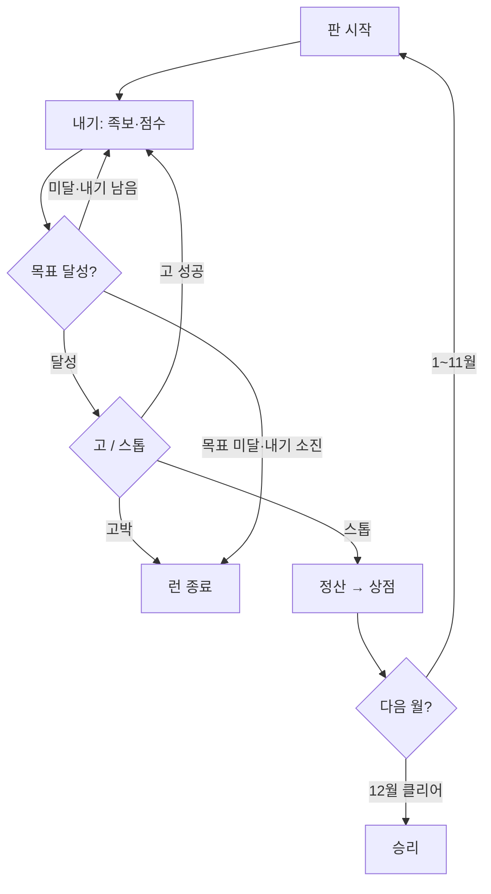

# 화투로 — 기획서

> **한 줄:** 한국 화투 48장으로 하는 1인용 Balatro라이크.  
> 고스톱의 족보·고/스톱·박을, 칩×배수 스코어링·상점·한 해 12판 런에 녹인다.


|         |                                                                          |
| ------- | ------------------------------------------------------------------------ |
| 장르      | 로그라이크 덱빌더 / 카드                                                           |
| 플레이     | 1인 · 웹 (`index.html`)                                                    |
| 한 런     | 1월 → 12월 (12판)                                                           |
| 플레이 URL | [https://sleeeppy.github.io/hwatro/](https://sleeeppy.github.io/hwatro/) |
| 관련 문서   | 규칙 요약 → `README.md` · 구현 규칙 → `CLAUDE.md` · 작업 인수인계 → `HANDOFF.md`       |


---

## 1. 왜 이 게임인가


| 가져올 것                  | 출처      |
| ---------------------- | ------- |
| 족보·고/스톱·박·정산의 긴장       | 고스톱     |
| 칩 × 배수, 블라인드 커브, 조커 상점 | Balatro |
| 한 해를 도는 서사·계절감         | 화투 월 체계 |


**플레이 판타지:**  
손패를 짜고 → 한 방 족보로 목표를 넘기고 → 욕심내어 **고**를 외치거나 **스톱**으로 도망치고 → 냥으로 특수패를 사 빌드를 키운다.

---

## 2. 핵심 루프

한 해(런) 안에서 매 달 반복:

1. **판 시작** — 손패 8 · 내기 4 · 버리기 4
2. **내기** — 1~5장 선택 → 족보·점수
3. **목표 달성?**
  - **고** → 다음 문턱으로 계속 (실패 시 고박 = 런 종료)  
  - **스톱** → 정산
4. **정산** — 냥 획득
5. **상점** — 특수패 구매·리롤 → 다음 월
6. **12월 클리어** 시 승리 / 목표 미달·고박 시 런 종료




| 단계  | 플레이어가 하는 일  | 보상 / 리스크                 |
| --- | ----------- | ------------------------ |
| 내기  | 족보·배수 극대화   | 점수                       |
| 고   | 더 높은 문턱에 도전 | 보너스 냥 · 실패 시 **고박=런 종료** |
| 스톱  | 안전하게 정산     | 다음 달로                    |
| 상점  | 특수패 구매·리롤   | 빌드 강화                    |


---


## 3. 런 구조 — 한 해 12달


| 월   | 이름  | 목표   | 비고               |
| --- | --- | ---- | ---------------- |
| 1   | 송학  | 160  | 튜토리얼·조합 오라       |
| 2   | 매조  | 240  |                  |
| 3   | 벚꽃  | 330  | **박**            |
| 4   | 흑싸리 | 450  |                  |
| 5   | 난초  | 600  |                  |
| 6   | 모란  | 820  | **박**            |
| 7   | 홍싸리 | 1150 |                  |
| 8   | 공산  | 1600 |                  |
| 9   | 국진  | 2200 | **박**            |
| 10  | 단풍  | 3000 |                  |
| 11  | 오동  | 4100 |                  |
| 12  | 비   | 5500 | **박** · 클리어 시 승리 |


- **낮/밤:** 홀수 달 = 낮 ☀️ · 짝수 달 = 밤 🌙  
- **박 라운드:** 3 · 6 · 9 · 12월 (직전 상점에서 예고, 12월은 후보 2택 1)

---


## 4. 점수


### 공식

```text
점수 = (코어 카드 칩 합) × 족보 배수 × (특수패 ×배수들)
     + flat(비코어 칩 + 특수패 +점수들)
```

- **족보 기본칩 없음** — 배수가 족보의 전부.
- **코어:** 족보를 만든 카드만 배수를 탄다. 같이 낸 나머지 칩은 flat.
- `Math.floor`는 **최종 점수 1회만**.


### 카드 칩


| 종류  | 칩   |
| --- | --- |
| 광   | 12  |
| 열끗  | 8   |
| 띠   | 6   |
| 쌍피  | 5   |
| 피   | 2   |


쌍피 = 피 2장으로 환산 (피 5장 족보 판정).

### 칩 보정 순서 (바꾸면 밸런스 붕괴)

1. 기본 칩
2. **이달의 패** — 현재 월 카드 ×2
3. **밤일낮장** — 낮: 광·열끗 +2 / 밤: 띠·피·쌍피 +2
4. **박 디버프** — 해당 종류 칩 0 (피박보험 시 무시)


### 한 판 리소스


| 항목         | 값             |
| ---------- | ------------- |
| 손패         | 8장            |
| 내기         | 4회 (고 1회당 +1) |
| 버리기        | 4회            |
| 한 번에 내는 장수 | 1~5장          |


---


## 5. 족보 (위가 우선)


| 순위  | 족보           | 배수  | 비고              |
| --- | ------------ | --- | --------------- |
| 1   | 오광           | ×12 | 광 5             |
| 2   | 사광           | ×8  | 광 4             |
| 3   | 총통           | ×7  | 같은 달 4장         |
| 4   | 고도리          | ×6  | 2·4·8월 새 열끗 3   |
| 5   | 삼광           | ×5  | 광 3 (비광 없음)     |
| 6   | 비삼광          | ×4  | 광 3 + 비광        |
| 7   | 홍단 / 청단 / 초단 | ×4  | 각 띠 3장          |
| 8   | 같은 달 3장      | ×3  |                 |
| 9   | 열끗 셋         | ×3  | 코어 3장, 초과는 flat |
| 10  | 띠 셋          | ×2  | 비단(12월 띠) 제외    |
| 11  | 피 5장         | ×3  | 쌍피=2 환산         |
| 12  | 같은 달 2장      | ×2  |                 |
| 13  | 무조합          | ×1  |                 |


국진(9월 열끗)은 열끗 ↔ 쌍피 전환 가능.

---


## 6. 고 / 스톱

목표를 넘기면 **고** 또는 **스톱**. (12월은 클리어로 직행)


|     | 스톱      | 고                      |
| --- | ------- | ---------------------- |
| 결과  | 정산 → 상점 | 다음 문턱으로 계속             |
| 이득  | 안전      | 내기 +1 · 손패 보충 · 성공 시 냥 |
| 실패  | —       | **고박 = 런 종료**          |


### 문턱 · 보상 (현행)


| 항목     | 공식                        |
| ------ | ------------------------- |
| n고 문턱  | `ceil(기본목표 × (1 + 0.6n))` |
| 성공 보너스 | **n × m** 냥 (m = 현재 월)    |


**밀치기 고:** 선언 시점에 이미 넘긴 문턱은 전부 소급.  
큰 한 방이면 1고 → 3고처럼 점프. 선언 목표는 항상 현재 점수보다 커서, 공짜 연쇄 고는 없다.  
내기 +1은 **선언 1회당 1개** (밀친 단계 수와 무관).

### 설계 의도


| 구간   | 의도                                  |
| ---- | ----------------------------------- |
| 1~3월 | 고를 많이 밀어도 냥이 적음 (`n×m`) · 문턱도 조금 빡셈 |
| 7월~  | 고 자체가 어려움 → 성공 시 보상은 넉넉해도 됨         |


---


## 7. 경제 · 상점


### 정산 구성


| 항목    | 내용                  |
| ----- | ------------------- |
| 이자    | 보유 5냥당 1냥, **최대 5** |
| 기본    | 일반 4 / 박 라운드 6      |
| 남은 내기 | 1회당 1냥              |
| 고 보너스 | n × m               |
| 기타    | 피박보험 정산 +1 등        |


시작 자금 **4냥**. 특수패 소지 **최대 5**.

### 특수패 12종


| 이름   | 희귀  | 가격  | 역할                  |
| ---- | --- | --- | ------------------- |
| 광팔이  | 커먼  | 3   | 광 낼 때 +1냥 (판당 최대 3) |
| 피장사꾼 | 커먼  | 4   | 피/쌍피 +점수 (배수 밖)     |
| 멍따   | 커먼  | 4   | 열끗 +점수 (배수 밖)       |
| 쪽집게  | 커먼  | 4   | 같은 달 2장 시 +2배수      |
| 싹쓸이  | 언커먼 | 6   | 정확히 5장 +30 (배수 밖)   |
| 고도리꾼 | 언커먼 | 6   | 고도리 새당 +3배수         |
| 단골손님 | 언커먼 | 6   | 단/띠셋 +6배수           |
| 비광우산 | 언커먼 | 6   | 코어에 12월 있으면 ×2      |
| 흔들기  | 언커먼 | 7   | 같은 달 2장↑ 있으면 ×1.5   |
| 밑장빼기 | 레어  | 8   | 버리기마다 영구 +8 flat    |
| 피박보험 | 레어  | 8   | 피/광/멍박 무효 + 정산 +1   |
| 폭탄   | 레어  | 9   | 같은 달 3장·총통 ×3       |


---


## 8. 박 (보스 디버프)


| 이름     | 효과                            |
| ------ | ----------------------------- |
| 피박     | 피·쌍피 칩 0 (족보 카운트는 유지)         |
| 광박     | 광 칩 0                         |
| 멍박     | 열끗 칩 0                        |
| 흔들기 금지 | 같은 달 2·3장·총통 → 무조합 / 흔들기 패 무효 |
| 비바람    | 버리기 불가                        |
| 안개     | 손패 3장 뒷면 (낼 때 공개)             |


3월은 약한 박(피/광/멍) 위주.

---


## 9. UX · 연출 원칙


| 원칙  | 내용                                              |
| --- | ----------------------------------------------- |
| 주스  | 점수 카운트업 · 족보 배너 · 고 연출이 도파민의 핵심                 |
| 용어  | 고스톱·한국 전통 표현 우선 (피박, 밑장빼기, 밤일낮장…)               |
| 모바일 | 一手 조작·터치 영역·팝업 위치 우선                            |
| 온보딩 | 1월 Balatro식 스포트라이트 + 조합 오라(월 3회)                |
| 춘향  | 킥 캐릭터. 조력자형 → **소모 인터랙션(단일 효과)** 으로 개편 검토 (§11) |


---


## 10. 밸런스 철학


| 원칙    | 설명                                      |
| ----- | --------------------------------------- |
| 빡빡하게  | 너프보다 목표·벽을 올리는 쪽을 우선                    |
| 초반 경제 | 고 파밍으로 상점을 박살 내지 않게 (`n×m` + 문턱 0.6)    |
| 종반    | 배수 특수패 + 고 스노우볼 없으면 막히게                 |
| 검증    | `node test/test-game.mjs` (그리디 봇 시뮬레이션) |


대략적 벽 (봇 기준): 무조커 ~3월 · 상점 봇 ~7–8월.

---


## 11. 로드맵


### 검토 중 (우선)


#### A. 손패 + 바닥패

바닥패를 적극 활용하는 방향을 검토 중.


| 항목    | 방향 (초안)                                   |
| ----- | ----------------------------------------- |
| 깔림    | 판 시작 시 바닥패가 **랜덤 장수**로 공개                 |
| 상호작용  | 손패를 바닥패에 **붙여** 사용                        |
| 점수    | 붙인 결과의 **총 점수에 배율을 곱함**                   |
| 아직 미정 | 장수 범위 · 붙이기 조건(같은 달 등) · 배수 곡선 · 바닥 보충 여부 |


> 예전 제안(멍석 = 칩·족보에 합류 / 따닥 ×1.5)과는 **다른 축**.  
> 지금은 “합류”보다 **총점 × 배수** 쪽이 후보. 확정 전 밸런스·연출 프로토타입 필요.


#### B. 춘향 — 조력자 ❌ → 한 가지 킥의 소모 인터랙션 ✅

춘향은 게임의 **킥(개성)** 으로 두고, 만능 조력자·상시 훈수는 쓰지 않는다.  
역할은 **하나**, 효과는 **짧고 분명**, 분위기는 **내러티브로 녹인다**.


| 예시 (검토) | 효과 한 줄                 | 톤          |
| ------- | ---------------------- | ---------- |
| 막걸리     | 바로 다음에 나올 패 **1장** 엿보기 | 취기·살짝 반칙   |
| 소주      | **버리기 횟수** 늘리기         | 독한 한 방·무리수 |


| 원칙    | 내용                                   |
| ----- | ------------------------------------ |
| 단일 역할 | 한 상호작용 = 한 효과. 표정+덱엿보기+예약훈수 동시 X     |
| 소모/선택 | 판·상점에서 “무엇을 먹일지” 고르는 맛이 본체           |
| 내러티브  | 대사·연출로 화투판 분위기와 맞춤 (현대 UI 툴팁 캐릭터 아님) |
| 밸런스   | 정보·리소스 이득이 고/상점과 겹치지 않게 가격·쿨 설계      |


### 후보 (스펙 분리)


| 후보      | 한 줄        |
| ------- | ---------- |
| 보너스피    | 덱 성장 소모품   |
| 족보책     | 족보 영구 강화   |
| 뒤집기 찬스  | 도박성 이벤트    |
| 나가리     | 실패 시 목표 이월 |
| 저장/불러오기 | 런 이어하기     |


---


## 12. 구현 · 기획 시 지킬 것

상세 코드 규칙은 `CLAUDE.md`.

### 엔진 / 코드

- `ENGINE START/END` 구간은 DOM 금지 (테스트 추출).
- 카드 선택은 **uid**.
- 고 목표는 `goThreshold` / `goLevelReached`만 사용.
- 족보·코어 선정은 `detectHandInfo` 한곳.
- 경제 사이드이펙트는 `playSelected()`에서만.


### 바닥패 (도입 시)

- 배수는 **최종 총점 이후**에 곱한다. (칩 보정·족보 배수·특수패와 순서를 문서에 고정)
- 붙이기 조건·장수·보충 규칙을 바꾸면 **봇 시뮬 재실행** 필수.
- 프리뷰(예상 점수)에 바닥 배수·붙일 대상 하이라이트를 반드시 포함.


### 춘향 (개편 시)

- **한 행동 = 한 효과**만 구현. 상시 훈수·다기능 UI로 되돌리지 않음.
- 효과는 “정보” 또는 “리소스” 중 하나로 명확히 (막걸리=정보, 소주=리소스 등).
- 텍스트·연출로 세계관에 녹일 것. 기능만 있는 버튼으로 두지 않음.

---

*마지막 정리: 고* `1+0.6n` *· 보너스* `n×m` *· 바닥패(총점×배수) · 춘향 단일 킥 검토 반영.*

# 결론.⭐️

앞으로 해야할것들.

발라트로 타로/유령/행성 카드 시스템 추가 고려

### 이 부분은 피그마 빨간 박스 참고

(피그마에 원조 게임 시스템 정리해뒀어요)

1. 조커 카드(아이템) 벨런싱 및 기획
2. 게임 진행 커브 벨런싱
3. 화투 패 특수패로 강화하는 시스템 추가 고려 기획 (발라트로 플레잉 카드)
4. 바닥 패 시스템을 넣을지/말지
5. 조합 배율 강화하는 것을 어떻게 디자인할지
6. 춘향이

